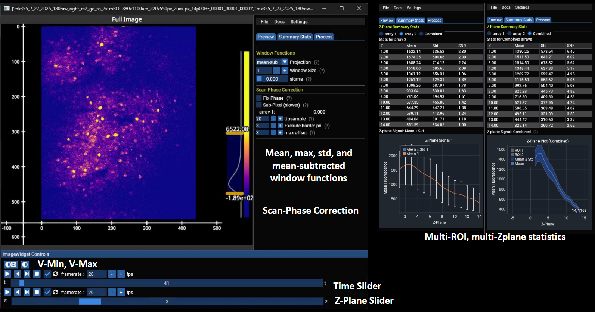
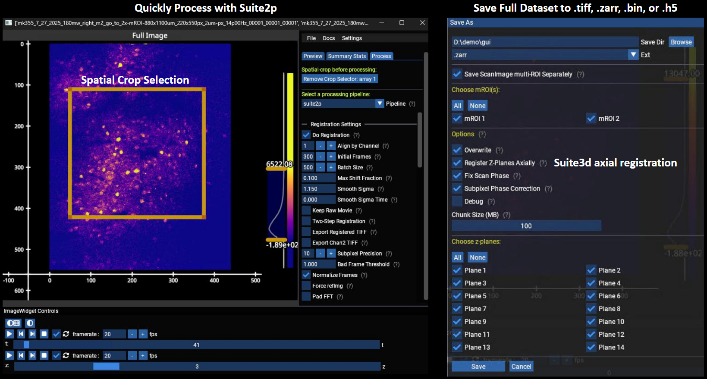

<p align="center">

</p>

---

[](https://github.com/MillerBrainObservatory/mbo_utilities/actions/workflows/ci.yml)
[](https://badge.fury.io/py/mbo-utilities)
[](https://millerbrainobservatory.github.io/mbo_utilities/)

[**Installation**](#installation) |
[**Documentation**](https://millerbrainobservatory.github.io/mbo_utilities/) |
[**User Guide**](https://millerbrainobservatory.github.io/mbo_utilities/user_guide.html) |
[**Array Types**](https://millerbrainobservatory.github.io/mbo_utilities/array_types.html) |
[**Issues**](https://github.com/MillerBrainObservatory/mbo_utilities/issues)

Image processing utilities for the [Miller Brain Observatory](https://github.com/MillerBrainObservatory) (MBO). Fast, lazy I/O with `imread`/`imwrite` for multiple array types (ScanImage and generic TIFFs, Suite2p binaries, Zarr and HDF5), an interactive GUI for data visualization, and processing pipelines for calcium imaging data.

<div align="center">
  
  
</div>

> **Note:**
> `mbo_utilities` is in **late-beta** stage of active development. There will be bugs that can be addressed quickly, file an [issue](https://github.com/MillerBrainObservatory/mbo_utilities/issues) or reach out on slack.

## Installation

### Quick Install

The provided installation scripts will install [UV](https://docs.astral.sh/uv/getting-started/features/) and allow you to choose a set of optional dependencies.

**Windows (PowerShell):**

```powershell
irm https://raw.githubusercontent.com/MillerBrainObservatory/mbo_utilities/master/scripts/install.ps1 | iex
```

**Linux/macOS:**

```bash
curl -sSL https://raw.githubusercontent.com/MillerBrainObservatory/mbo_utilities/master/scripts/install.sh | bash
```

### Pip

We recommend creating a virtual environment to install all python packages with `pip` ([see the MBO guide](https://millerbrainobservatory.github.io/guides/venvs.html)).

```bash
uv venv --python 3.12.9
uv pip install mbo_utilities

# install all optional dependencies
uv pip install "mbo_utilities[all]"
```

| Method | Location | Use Case |
|--------|----------|----------|
| `uv pip install` in project | `project/.venv/` | Project-specific, use with `uv run mbo` |
| `uv tool install mbo_utilities` | `~/.local/bin/` | Global `mbo` command |

## Usage

### Launch GUI

```bash
# in a project with .venv
uv run mbo

# global installation
mbo
```

### Commands

| Command | Description |
|---------|-------------|
| `uv run mbo` | Launch interactive GUI |
| `uv run mbo --check-install` | Verify installation and GPU configuration |
| `uv run mbo --download-notebook` | Download user guide notebook |
| `uv run mbo info /path/to/data.tiff` | Show file info |
| `uv run mbo convert input.tiff output.zarr` | Convert file formats |
| `uv run mbo scanphase /path/to/data.tiff` | Scan-phase analysis |
| `uv run mbo formats` | List supported formats |
| `uv run pollen` | Pollen calibration tool |

### Processing Pipelines

The GUI supports registration/segmentation pipelines. Currently, the only supported pipeline is LBM-Suite2p-Python.

```bash
uv pip install mbo_utilities[suite2p]
```

Future prospects include [masknmf](https://github.com/apasarkar/masknmf-toolbox).

## Uninstall

**If installed via quick install script:**

```powershell
# Windows
uv tool uninstall mbo_utilities
Remove-Item -Recurse -Force "$env:USERPROFILE\.mbo"
Remove-Item "$env:USERPROFILE\Desktop\MBO Utilities.lnk" -ErrorAction SilentlyContinue
```

```bash
# Linux/macOS
uv tool uninstall mbo_utilities
rm -rf ~/.mbo
```

**If installed in a project venv:**

```bash
uv pip uninstall mbo_utilities
```

## Troubleshooting

<details>
<summary><b>GPU/CUDA Errors</b></summary>

**Error: "Failed to auto-detect CUDA root directory"**

This occurs when using GPU-accelerated features and CuPy cannot find your CUDA Toolkit.

**Check if CUDA is installed:**

```powershell
# Windows
dir "C:\Program Files\NVIDIA GPU Computing Toolkit\CUDA" -ErrorAction SilentlyContinue
$env:CUDA_PATH
```

```bash
# Linux/macOS
nvcc --version
echo $CUDA_PATH
```

**Set CUDA_PATH:**

```powershell
# Windows (replace v12.6 with your version)
$env:CUDA_PATH = "C:\Program Files\NVIDIA GPU Computing Toolkit\CUDA\v12.6"
[System.Environment]::SetEnvironmentVariable('CUDA_PATH', $env:CUDA_PATH, 'User')
```

```bash
# Linux/macOS (add to ~/.bashrc or ~/.zshrc)
export CUDA_PATH=/usr/local/cuda-12.6
```

If CUDA is not installed, download from [NVIDIA CUDA Downloads](https://developer.nvidia.com/cuda-downloads).

</details>

<details>
<summary><b>Git LFS Download Errors</b></summary>

There is a [bug in fastplotlib](https://github.com/fastplotlib/fastplotlib/issues/861) causing `git lfs` errors when installed from a git branch.

Set `GIT_LFS_SKIP_SMUDGE=1` and restart your terminal:

```powershell
# Windows
[System.Environment]::SetEnvironmentVariable('GIT_LFS_SKIP_SMUDGE', '1', 'User')
```

```bash
# Linux/macOS
echo 'export GIT_LFS_SKIP_SMUDGE=1' >> ~/.bashrc
source ~/.bashrc
```

</details>

## Built With

- **[Suite2p](https://github.com/MouseLand/suite2p)** - Integration support
- **[Rastermap](https://github.com/MouseLand/rastermap)** - Visualization
- **[Suite3D](https://github.com/alihaydaroglu/suite3d)** - Volumetric processing

## Issues & Support

- **Bug reports:** [GitHub Issues](https://github.com/MillerBrainObservatory/mbo_utilities/issues)
- **Questions:** See [documentation](https://millerbrainobservatory.github.io/mbo_utilities/) or open a discussion
