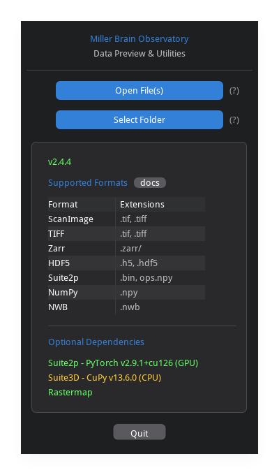
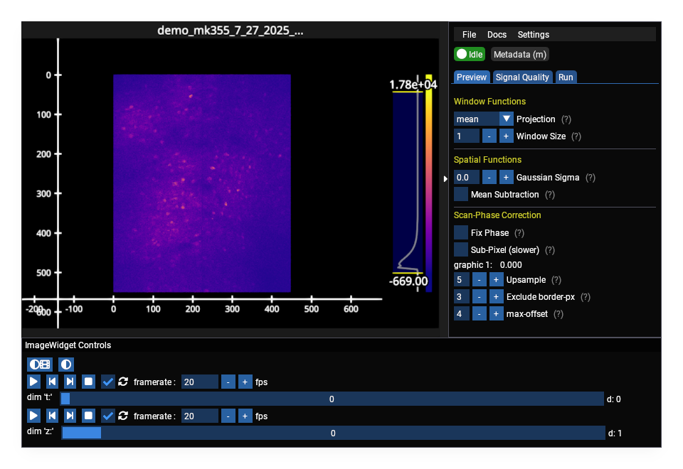

<p align="center">

</p>

<p align="center">
<a href="https://github.com/MillerBrainObservatory/mbo_utilities/actions/workflows/test_python.yml"></a>
<a href="https://badge.fury.io/py/mbo-utilities"></a>
<a href="https://millerbrainobservatory.github.io/mbo_utilities/"></a>
</p>

<p align="center">
<a href="#installation"><b>Installation</b></a> ·
<a href="https://millerbrainobservatory.github.io/mbo_utilities/"><b>Documentation</b></a> ·
<a href="https://millerbrainobservatory.github.io/mbo_utilities/user_guide.html"><b>User Guide</b></a> ·
<a href="https://millerbrainobservatory.github.io/mbo_utilities/file_formats.html"><b>Supported Formats</b></a> ·
<a href="https://github.com/MillerBrainObservatory/mbo_utilities/issues"><b>Issues</b></a>
</p>

Image processing utilities for the [Miller Brain Observatory](https://github.com/MillerBrainObservatory) (MBO).

- **Read and write imaging data** with `imread`/`imwrite` - fast, lazy I/O for ScanImage TIFFs, generic TIFFs, Suite2p binaries, Zarr, and HDF5
- **Run processing pipelines** for calcium imaging - motion correction, cell extraction, and signal analysis
- **Visualize data interactively** with a GPU-accelerated GUI for exploring large datasets

<p align="center">
  <br/>
  <em>Select files or folders to preview</em>
</p>

<p align="center">
  <br/>
  <em>GPU-accelerated data viewer with interactive controls</em>
</p>

> **Note:**
> `mbo_utilities` is in **late-beta** stage of active development. There will be bugs that can be addressed quickly, file an [issue](https://github.com/MillerBrainObservatory/mbo_utilities/issues) or reach out on slack.

## Installation

`mbo_utilities` is available in [pypi](https://pypi.org/project/mbo_utilities/):

`pip install mbo_utilities`

> For help setting up a virtual environment, see [the MBO guide on virtual environments](https://millerbrainobservatory.github.io/guides/venvs.html).

### Optional Dependencies

```bash
# with lbm_suite2p_python, suite2p, cellpose
pip install "mbo_utilities[suite2p]"

# all suite2p deps + rastermap
pip install "mbo_utilities[rastermap]"

# suite3D for axial (z-plane) registration
pip install "mbo_utilities[suite3d]"

# all of the above
pip install "mbo_utilities[all]"
```

### With [UV](https://docs.astral.sh/uv/getting-started/features/) (Recommended)

**One-line install scripts** (CLI + desktop shortcut):

```powershell
# Windows (PowerShell)
irm https://raw.githubusercontent.com/MillerBrainObservatory/mbo_utilities/master/scripts/install.ps1 | iex
```

```bash
# Linux/macOS
curl -sSL https://raw.githubusercontent.com/MillerBrainObservatory/mbo_utilities/master/scripts/install.sh | bash
```

These scripts install to `~/mbo/envs/mbo_utilities` and add `mbo` to your PATH.

### Environment Locations

| Method | Use Case | Run Command |
|--------|----------|-------------|
| `uv tool install` | CLI only | `mbo` |
| `uv pip install` | Scientific Data Processing | `uv run mbo` |
| Install script | CLI + desktop shortcut | `mbo` |

For library use, activate the venv or use `uv run`:

```bash
# option 1: activate
.venv\Scripts\activate  # Windows
source .venv/bin/activate  # Linux/macOS
mbo --help

# option 2: uv run (no activation needed)
uv run mbo --help
```

After [installing `uv`](https://docs.astral.sh/uv/getting-started/installation/#standalone-installer):

**For CLI usage only** (global `mbo` command):

```bash
uv tool install mbo_utilities
```

This installs the CLI globally. Not for use as a library in your own code.

**For library/development use** (import in your code):

```bash
uv venv --python 3.12
uv pip install mbo_utilities
```

This creates a project-specific virtual environment.


## Usage

**CLI Commands:**

| Command | Description |
|---------|-------------|
| `uv run mbo` | Launch interactive GUI |
| `uv run mbo --check-install` | Verify installation and GPU configuration |
| `uv run mbo /path/to/data.tiff` | View a supported file/folder |
| `uv run mbo /path/to/data.tiff --metadata` | View metadata for a supported file/folder |
| `uv run mbo --download-notebook` | Download user guide notebook |
| `uv run mbo info /path/to/data.tiff` | Show file info |
| `uv run mbo convert input.tiff output.zarr` | Convert file formats |
| `uv run mbo scanphase /path/to/data.tiff` | Scan-phase analysis |
| `uv run mbo formats` | List supported formats |
| `uv run mbo download path/to/notebook.ipynb` | Download a notebook to the current directory |
| `uv run pollen` | Pollen calibration tool (WIP) |

## Supported ScanImage Configurations

`mbo_utilities` automatically detects and parses metadata from these ScanImage acquisition modes:

| Configuration | Detection | Result |
|---------------|-----------|--------|
| LBM single channel | `channelSave=[1..N]`, AI0 only | `lbm=True`, `colors=1` |
| LBM dual channel | `channelSave=[1..N]`, AI0+AI1 | `lbm=True`, `colors=2` |
| Piezo (single frame/slice) | `enable=True`, `framesPerSlice=1` | `piezo=True` |
| Piezo multi-frame (with avg) | `enable=True`, `logAvgFactor>1` | `piezo=True`, averaged frames |
| Piezo multi-frame (no avg) | `enable=True`, `framesPerSlice>1`, `logAvg=1` | `piezo=True`, raw frames |
| Single plane | `enable=False` | `zplanes=1` |

> **Note:** Frame-averaging (`logAverageFactor > 1`) is only available for non-LBM acquisitions.

## Uninstall

**If installed via quick install script:**

```powershell
# Windows
uv tool uninstall mbo_utilities
Remove-Item -Recurse -Force "$env:USERPROFILE\.mbo"
Remove-Item "$env:USERPROFILE\Desktop\MBO Utilities.lnk" -ErrorAction SilentlyContinue
```

```bash
# Linux/macOS
uv tool uninstall mbo_utilities
rm -rf ~/mbo
```

**If installed in a project venv:**

```bash
uv pip uninstall mbo_utilities
```

## Troubleshooting

<details>
<summary><b>GPU/CUDA Errors</b></summary>

**Error: "Failed to auto-detect CUDA root directory"**

This occurs when using GPU-accelerated features and CuPy cannot find your CUDA Toolkit.

**Check if CUDA is installed:**

```powershell
# Windows
dir "C:\Program Files\NVIDIA GPU Computing Toolkit\CUDA" -ErrorAction SilentlyContinue
$env:CUDA_PATH
```

```bash
# Linux/macOS
nvcc --version
echo $CUDA_PATH
```

**Set CUDA_PATH:**

```powershell
# Windows (replace v12.6 with your version)
$env:CUDA_PATH = "C:\Program Files\NVIDIA GPU Computing Toolkit\CUDA\v12.6"
[System.Environment]::SetEnvironmentVariable('CUDA_PATH', $env:CUDA_PATH, 'User')
```

```bash
# Linux/macOS (add to ~/.bashrc or ~/.zshrc)
export CUDA_PATH=/usr/local/cuda-12.6
```

If CUDA is not installed, download from [NVIDIA CUDA Downloads](https://developer.nvidia.com/cuda-downloads).

</details>

<details>
<summary><b>Git LFS Download Errors</b></summary>

There is a [bug in fastplotlib](https://github.com/fastplotlib/fastplotlib/issues/861) causing `git lfs` errors when installed from a git branch.

Set `GIT_LFS_SKIP_SMUDGE=1` and restart your terminal:

```powershell
# Windows
[System.Environment]::SetEnvironmentVariable('GIT_LFS_SKIP_SMUDGE', '1', 'User')
```

```bash
# Linux/macOS
echo 'export GIT_LFS_SKIP_SMUDGE=1' >> ~/.bashrc
source ~/.bashrc
```

</details>

## Built With

- **[Suite2p](https://github.com/MouseLand/suite2p)** - Integration support
- **[Rastermap](https://github.com/MouseLand/rastermap)** - Visualization
- **[Suite3D](https://github.com/alihaydaroglu/suite3d)** - Volumetric processing

## Issues & Support

- **Bug reports:** [GitHub Issues](https://github.com/MillerBrainObservatory/mbo_utilities/issues)
- **Questions:** See [documentation](https://millerbrainobservatory.github.io/mbo_utilities/) or open a discussion
