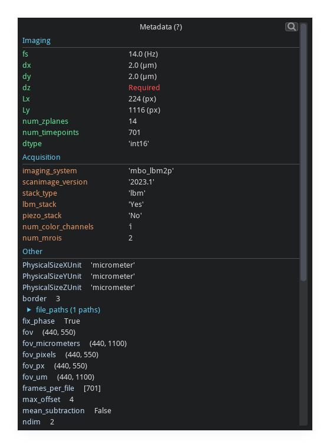

<p align="center">

</p>

<p align="center">
<a href="https://github.com/MillerBrainObservatory/mbo_utilities/actions/workflows/test_python.yml"></a>
<a href="https://badge.fury.io/py/mbo-utilities"></a>
<a href="https://millerbrainobservatory.github.io/mbo_utilities/"></a>
</p>

<p align="center">
<a href="#installation"><b>Installation</b></a> ·
<a href="https://millerbrainobservatory.github.io/mbo_utilities/"><b>Documentation</b></a> ·
<a href="https://millerbrainobservatory.github.io/mbo_utilities/user_guide.html"><b>User Guide</b></a> ·
<a href="https://millerbrainobservatory.github.io/mbo_utilities/file_formats.html"><b>Supported Formats</b></a> ·
<a href="https://github.com/MillerBrainObservatory/mbo_utilities/issues"><b>Issues</b></a>
</p>

Image processing utilities for the [Miller Brain Observatory](https://github.com/MillerBrainObservatory) (MBO).

- **Read and write imaging data** with `imread`/`imwrite` - fast, lazy I/O for ScanImage TIFFs, generic TIFFs, Suite2p binaries, Zarr, and HDF5
- **Run processing pipelines** for calcium imaging - motion correction, cell extraction, and signal analysis
- **Visualize data interactively** with a GPU-accelerated GUI for exploring large datasets

<p align="center">
  
  
  
  <br/>
  <em>Easily open and explore large datasets with GPU-accelerated visualization</em>
</p>

> **Note:**
> `mbo_utilities` is in **late-beta** stage of active development. There will be bugs that can be addressed quickly, file an [issue](https://github.com/MillerBrainObservatory/mbo_utilities/issues) or reach out on slack.

## Installation

`mbo_utilities` is available in [pypi](https://pypi.org/project/mbo_utilities/):

`pip install mbo_utilities`

> We recommend using a virtual environment. For help setting up a virtual environment, see [the MBO guide on virtual environments](https://millerbrainobservatory.github.io/guides/venvs.html).

```bash

# Base, reader + GUI
pip install mbo_utilities
 
# with choose any or all optional dependencies
pip install "mbo_utilities[suite2p, suite3d, rastermap]"

pip install "mbo_utilities[all]"
```

### Installation Script with [UV](https://docs.astral.sh/uv/getting-started/features/) (Recommended)

The install script will allow you to:
1. Create a virtual environment with `mbo_utilities`,
2. Install `mbo` CLI globally, for quick and easy use in any terminal
3. Specify optional dependencies, and environment paths

```powershell
# Windows (PowerShell)
irm https://raw.githubusercontent.com/MillerBrainObservatory/mbo_utilities/master/scripts/install.ps1 | iex
```

```bash
# Linux/macOS
curl -sSL https://raw.githubusercontent.com/MillerBrainObservatory/mbo_utilities/master/scripts/install.sh | bash
```

> **Note:** The `mbo` command is available globally thanks to [uv tools](https://docs.astral.sh/uv/concepts/tools/). Update with the install script or manually with `uv tool upgrade mbo_utilities`.


## Usage

### Notebook

Use `imread` and `imwrite` for fast, lazy I/O across all supported formats. Works seamlessly in Jupyter notebooks for interactive data exploration and analysis.

```python
from mbo_utilities import imread, imwrite

data = imread("path/to/data.tiff")  # lazy dask array
imwrite("output.zarr", data)        # chunked zarr output
```

→ [Notebook Guide](https://millerbrainobservatory.github.io/mbo_utilities/user_guide.html)

### CLI

The `mbo` command provides quick access to file conversion, metadata inspection, and analysis tools directly from the terminal.

| Command | Description |
|---------|-------------|
| `mbo /path/to/data.tiff` | View a supported file/folder |
| `mbo info /path/to/data.tiff` | Show file info and metadata |
| `mbo convert input.tiff output.zarr` | Convert between formats |
| `mbo scanphase /path/to/data.tiff` | Run scan-phase analysis |
| `mbo formats` | List supported formats |
| `mbo download notebook.ipynb` | Download example notebook |

→ [CLI Guide](https://millerbrainobservatory.github.io/mbo_utilities/cli.html)

### GUI

Launch an interactive GPU-accelerated viewer for exploring large imaging datasets. Supports all MBO file formats with real-time visualization.

```bash
mbo                    # launch GUI
mbo /path/to/data      # open file directly
mbo --check-install    # verify GPU configuration
```

→ [GUI Guide](https://millerbrainobservatory.github.io/mbo_utilities/guides/gui.html)

### Scan-Phase Analysis

Measure and correct bidirectional scan-phase offset in resonant scanning microscopy data. Generates diagnostic figures showing temporal stability, spatial variation, and recommended corrections.

```bash
mbo scanphase /path/to/data.tiff -o ./output
```

→ [Scan-Phase Guide](https://millerbrainobservatory.github.io/mbo_utilities/guides/scanphase.html)

### Supported Formats

| Format | Read | Write | Description |
|--------|:----:|:-----:|-------------|
| ScanImage TIFF | ✓ | ✓ | Native LBM acquisition format |
| Generic TIFF | ✓ | ✓ | Standard TIFF stacks |
| Zarr | ✓ | ✓ | Chunked cloud-ready arrays |
| HDF5 | ✓ | ✓ | Hierarchical data format |
| Suite2p | ✓ | — | Binary and ops.npy files |

→ [Formats Guide](https://millerbrainobservatory.github.io/mbo_utilities/file_formats.html)

### Upgrade

| Method | Command |
|--------|---------|
| Install script | Re-run install script |
| CLI tool | `uv tool upgrade mbo_utilities` |
| Virtual env | `uv pip install -U mbo_utilities` |

## ScanImage Acquisition Modes

`mbo_utilities` automatically detects and parses metadata from these ScanImage acquisition modes:

| Configuration | Detection | Result |
|---------------|-----------|--------|
| LBM single channel | `channelSave=[1..N]`, AI0 only | `lbm=True`, `colors=1` |
| LBM dual channel | `channelSave=[1..N]`, AI0+AI1 | `lbm=True`, `colors=2` |
| Piezo (single frame/slice) | `enable=True`, `framesPerSlice=1` | `piezo=True` |
| Piezo multi-frame (with avg) | `enable=True`, `logAvgFactor>1` | `piezo=True`, averaged frames |
| Piezo multi-frame (no avg) | `enable=True`, `framesPerSlice>1`, `logAvg=1` | `piezo=True`, raw frames |
| Single plane | `enable=False` | `zplanes=1` |

> **Note:** Frame-averaging (`logAverageFactor > 1`) is only available for non-LBM acquisitions.

## Uninstall

**If installed via quick install script:**

```powershell
# Windows
uv tool uninstall mbo_utilities
Remove-Item -Recurse -Force "$env:USERPROFILE\.mbo"
Remove-Item "$env:USERPROFILE\Desktop\MBO Utilities.lnk" -ErrorAction SilentlyContinue
```

```bash
# Linux/macOS
uv tool uninstall mbo_utilities
rm -rf ~/mbo
```

**If installed in a project venv:**

```bash
uv pip uninstall mbo_utilities
```

## Troubleshooting

<details>
<summary><b>GPU/CUDA Errors</b></summary>

**Error: "Failed to auto-detect CUDA root directory"**

This occurs when using GPU-accelerated features and CuPy cannot find your CUDA Toolkit.

**Check if CUDA is installed:**

```powershell
# Windows
dir "C:\Program Files\NVIDIA GPU Computing Toolkit\CUDA" -ErrorAction SilentlyContinue
$env:CUDA_PATH
```

```bash
# Linux/macOS
nvcc --version
echo $CUDA_PATH
```

**Set CUDA_PATH:**

```powershell
# Windows (replace v12.6 with your version)
$env:CUDA_PATH = "C:\Program Files\NVIDIA GPU Computing Toolkit\CUDA\v12.6"
[System.Environment]::SetEnvironmentVariable('CUDA_PATH', $env:CUDA_PATH, 'User')
```

```bash
# Linux/macOS (add to ~/.bashrc or ~/.zshrc)
export CUDA_PATH=/usr/local/cuda-12.6
```

If CUDA is not installed, download from [NVIDIA CUDA Downloads](https://developer.nvidia.com/cuda-downloads).

</details>

<details>
<summary><b>Git LFS Download Errors</b></summary>

There is a [bug in fastplotlib](https://github.com/fastplotlib/fastplotlib/issues/861) causing `git lfs` errors when installed from a git branch.

Set `GIT_LFS_SKIP_SMUDGE=1` and restart your terminal:

```powershell
# Windows
[System.Environment]::SetEnvironmentVariable('GIT_LFS_SKIP_SMUDGE', '1', 'User')
```

```bash
# Linux/macOS
echo 'export GIT_LFS_SKIP_SMUDGE=1' >> ~/.bashrc
source ~/.bashrc
```

</details>

## Built With

- **[Suite2p](https://github.com/MouseLand/suite2p)** - Integration support
- **[Rastermap](https://github.com/MouseLand/rastermap)** - Visualization
- **[Suite3D](https://github.com/alihaydaroglu/suite3d)** - Volumetric processing

## Issues & Support

- **Bug reports:** [GitHub Issues](https://github.com/MillerBrainObservatory/mbo_utilities/issues)
- **Questions:** See [documentation](https://millerbrainobservatory.github.io/mbo_utilities/) or open a discussion
