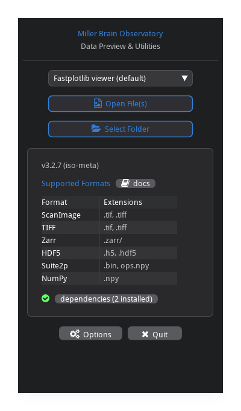
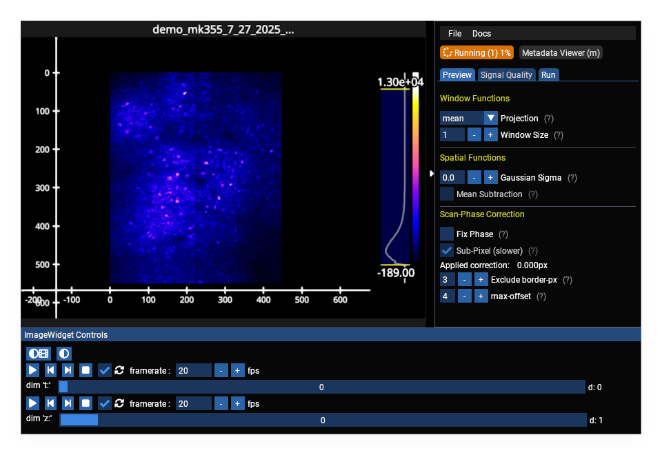
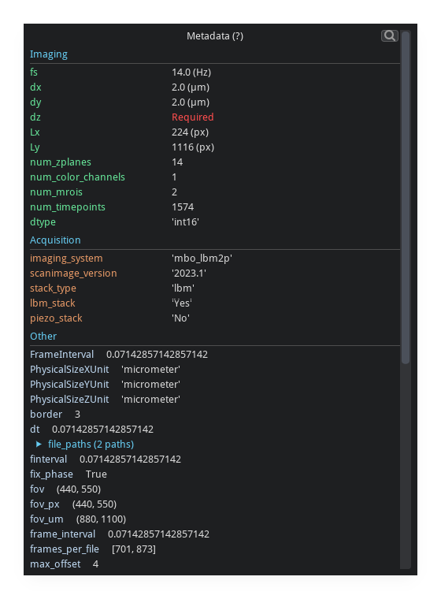

<p align="center">

</p>

<p align="center">
<a href="https://github.com/MillerBrainObservatory/mbo_utilities/actions/workflows/test_python.yml"></a>
<a href="https://badge.fury.io/py/mbo-utilities"></a>
<a href="https://millerbrainobservatory.github.io/mbo_utilities/"></a>
</p>

<p align="center">
<a href="#installation"><b>Installation</b></a> ·
<a href="https://millerbrainobservatory.github.io/mbo_utilities/"><b>Documentation</b></a> ·
<a href="https://millerbrainobservatory.github.io/mbo_utilities/user_guide.html"><b>User Guide</b></a> ·
<a href="https://millerbrainobservatory.github.io/mbo_utilities/file_formats.html"><b>Supported Formats</b></a> ·
<a href="https://github.com/MillerBrainObservatory/mbo_utilities/issues"><b>Issues</b></a>
</p>

Image processing utilities for the [Miller Brain Observatory](https://github.com/MillerBrainObservatory) (MBO).

- **Modern Image Reader/Writer**: Fast, lazy I/O for ScanImage/generic TIFFs, Suite2p `.bin`, Zarr, HDF5, and Numpy (in memeory or saved to `.npy`)
- **Run processing pipelines** for calcium imaging - motion correction, cell extraction, and signal analysis
- Operates on **3D timeseries** natively and is extendable to ND-arrays
- **Visualize data interactively** with the **Miller Brain Studio**, a GPU-accelerated GUI for exploring large datasets with [fastplotlib](https://fastplotlib.org/user_guide/guide.html#what-is-fastplotlib)

<p align="center">
  
  
  
  <br/>
  <em>Select data, visualize, and inspect metadata</em>
</p>

> **Note:**
> `mbo_utilities` is in **late-beta** stage of active development. There will be bugs that can be addressed quickly, file an [issue](https://github.com/MillerBrainObservatory/mbo_utilities/issues) or reach out on slack.

## Installation

We recommend [uv](https://docs.astral.sh/uv/) for managing environments.

Simply remove the `uv` from the below commands if using a different python package manager.

See [the MBO guide on virtual environments](https://millerbrainobservatory.github.io/guides/venvs.html) for more information on managing python environments.

```bash
uv venv --python 3.12.9
# .venv\Scripts\activate   # optional 
```

### Quick viewer (no install)

Open data in the viewer without installing anything:

```bash
uvx --from mbo-utilities mbo /path/to/data
```

### Base (viewer, I/O, metadata, scan-phase)

```bash
uv pip install mbo_utilities
```

The base install is lightweight (no pytorch). Add an extra for the
processing pipelines:

```bash
# suite2p / cellpose pipeline + rastermap + z-registration (pulls pytorch + Qt)
uv pip install "mbo_utilities[suite2p]"

# napari viewer
uv pip install "mbo_utilities[napari]"

# isoview light-sheet pipeline
uv pip install "mbo_utilities[isoview]"

# jupyterlab + notebook rendering
uv pip install "mbo_utilities[notebooks]"

# everything
uv pip install "mbo_utilities[all]"
```

### GPU dependencies

PyTorch and CuPy require CUDA-specific wheels that must be installed separately.

Suite2p (from the `[suite2p]` extra) requires pytorch. Installation depends on your cuda version. See the pytorch [Get Started](https://pytorch.org/get-started/locally/) page for the correct install command for your OS/Cuda version.

```bash
# pytorch with CUDA 12.N (required for suite2p GPU)
# make sure you uninstall any previous versions of pytorch
uv pip uninstall torch torchvision  
uv pip install torch torchvision --index-url https://download.pytorch.org/whl/cu126

# cupy (optional, enables GPU for axial registration)
nvidia-smi # check your cuda version first
uv pip install cupy-cuda12x  # for CUDA 12.x
uv pip install cupy-cuda11x  # for CUDA 11.x
```

### Verify installation

```bash
uv run mbo --check-install
```

This will show the status of all packages, GPU availability, and provide exact install commands for anything missing.

### Installation script (recommended for new users)

The install script handles environment creation, GPU detection, and optional dependencies automatically.

```powershell
# Windows (PowerShell)
irm https://raw.githubusercontent.com/MillerBrainObservatory/mbo_utilities/master/scripts/install.ps1 | iex
```

```bash
# Linux/macOS
curl -sSL https://raw.githubusercontent.com/MillerBrainObservatory/mbo_utilities/master/scripts/install.sh | bash
```

> **Note:** The `mbo` command is available globally thanks to [uv tools](https://docs.astral.sh/uv/concepts/tools/). Update with `uv tool upgrade mbo_utilities`.

## Usage

### Supported Formats

| Format | Read | Write | Description |
|--------|:----:|:-----:|-------------|
| ScanImage TIFF | ✓ | ✓ | Native LBM acquisition format |
| Generic TIFF | ✓ | ✓ | Standard TIFF stacks |
| Zarr | ✓ | ✓ | Chunked cloud-ready arrays |
| HDF5 | ✓ | ✓ | Hierarchical data format |
| Suite2p | ✓ | ✓ | Binary and ops.npy files |
| NumPy | ✓ | ✓ | In-memory arrays or `.npy` files |

→ [Formats Guide](https://millerbrainobservatory.github.io/mbo_utilities/file_formats.html)

To get started quickly, `mbo init path/to/data` will download the starter notebooks and auto-fill your data path.

The [user-guide](https://millerbrainobservatory.github.io/mbo_utilities/user_guide.html) covers usage in a jupyter notebook.
The [CLI Guide](https://millerbrainobservatory.github.io/mbo_utilities/cli.html) provides a more in-depth overview of the CLI commands.
The [GUI Guide](https://millerbrainobservatory.github.io/mbo_utilities/usage/gui_guide.html) provides a more in-depth overview of the GUI.
The [ScanPhase Guide](https://millerbrainobservatory.github.io/mbo_utilities/usage/cli.html#scan-phase-analysis) describes the bi-directional scan-phase analysis tool with output figures and figure descriptions.

| Command | Description |
|---------|-------------|
| `mbo init` | Create starter notebooks (mbo + LBM-Suite2p user guides) |
| `mbo /path/to/data.tiff` | View a supported file/folder |
| `mbo info /path/to/data.tiff` | Show file info and metadata |
| `mbo convert input.tiff output.zarr` | Convert between formats |
| `mbo scanphase /path/to/data.tiff` | Run scan-phase analysis |
| `mbo formats` | List supported formats |
| `mbo shortcut` | Create a desktop shortcut for a local installation |
| `mbo pollen` | Pollen calibration tool (WIP) |
| `mbo pollen path/to/data` | Pollen calibration - Skip data collection |

→ [CLI Guide](https://millerbrainobservatory.github.io/mbo_utilities/usage/cli.html)

### Miller Brain Studio

Launch an interactive GPU-accelerated viewer for exploring large imaging datasets. Supports all MBO file formats with real-time visualization.

Note again, `mbo` is how 

```bash
mbo                    # launch GUI
mbo /path/to/data      # open file directly
mbo --check-install    # verify GPU configuration
mbo shortcut           # add a desktop icon (Windows/Linux)
```

→ [GUI Guide](https://millerbrainobservatory.github.io/mbo_utilities/usage/gui_guide.html)

### Scan-Phase Analysis

Measure and correct bidirectional scan-phase offset in resonant scanning microscopy data. Generates diagnostic figures showing temporal stability, spatial variation, and recommended corrections.

```bash
mbo scanphase /path/to/data.tiff -o ./output
```

→ [Scan-Phase Guide](https://millerbrainobservatory.github.io/mbo_utilities/usage/cli.html#scan-phase-analysis)

### Axial (Z-plane) Registration

Compute per-plane rigid shifts that align z-planes to each other. Shifts are
stored in metadata, **not** baked into the saved pixels, so they can be applied
or removed non-destructively at read time.

```python
import mbo_utilities as mbo

# compute shifts on save; they are written to metadata["plane_shifts"]
mbo.imwrite(arr, "registered.zarr", ext=".zarr", register_z=True)

# apply them on read (reversible, source never modified)
data = mbo.imread("registered.zarr")
aligned = mbo.with_axial_shifts(data)        # reads metadata["plane_shifts"]
aligned.enabled = False                       # back to the raw frames

# or supply your own shifts (one (dy, dx) row per z-plane)
shifts = [[0, 0], [2, -1], [3, -2]]           # len must equal the Z size
aligned = mbo.with_axial_shifts(data, plane_shifts=shifts)
```

In Miller Brain Studio, datasets that carry valid `plane_shifts` are aligned
automatically on load. Saving the aligned view bakes the shifts into the output
pixels.

### Upgrade

The CLI tool can be upgraded with `uv tool upgrade mbo_utilities`, or the package can be upgraded with `uv pip install -U mbo_utilities`.

| Method | Command |
|--------|---------|
| Install script | Re-run install script |
| CLI tool | `uv tool upgrade mbo_utilities` |
| Virtual env | `uv pip install -U mbo_utilities` |

## ScanImage Acquisition Modes

`mbo_utilities` automatically detects and parses metadata from these ScanImage acquisition modes:

| Configuration | Detection | Result |
|---------------|-----------|--------|
| LBM single channel | `channelSave=[1..N]`, AI0 only | `lbm=True`, `colors=1` |
| LBM dual channel | `channelSave=[1..N]`, AI0+AI1 | `lbm=True`, `colors=2` |
| Piezo (single frame/slice) | `hStackManager.enable=False`, `framesPerSlice=1` | `piezo=True` |
| Piezo multi-frame (with avg) | `hStackManager.enable=False`, `logAvgFactor>1` | `piezo=True`, averaged frames |
| Piezo multi-frame (no avg) | `hStackManager.enable=False`, `framesPerSlice>1`, `logAvg=1` | `piezo=True`, raw frames |
| Single plane | `hStackManager.enable=False` | `zplanes=1` |

> **Note:** Frame-averaging (`logAverageFactor > 1`) is only available for non-LBM acquisitions.

## Uninstall

**If installed via quick install script:**

```powershell
# Windows
uv tool uninstall mbo_utilities
Remove-Item -Recurse -Force "$env:USERPROFILE\.mbo"
Remove-Item "$env:USERPROFILE\Desktop\Miller Brain Studio.lnk" -ErrorAction SilentlyContinue
```

```bash
# Linux/macOS
uv tool uninstall mbo_utilities
rm -rf ~/.mbo
```

**If installed in a project venv:**

```bash
uv pip uninstall mbo_utilities
```

## Troubleshooting

<details>
<summary><b>GPU/CUDA Errors</b></summary>

**Error: "Failed to auto-detect CUDA root directory"**

This occurs when using GPU-accelerated features and CuPy cannot find your CUDA Toolkit.

**Check if CUDA is installed:**

```powershell
# Windows
dir "C:\Program Files\NVIDIA GPU Computing Toolkit\CUDA" -ErrorAction SilentlyContinue
$env:CUDA_PATH
```

```bash
# Linux/macOS
nvcc --version
echo $CUDA_PATH
```

**Set CUDA_PATH:**

```powershell
# Windows (replace v12.6 with your version)
$env:CUDA_PATH = "C:\Program Files\NVIDIA GPU Computing Toolkit\CUDA\v12.6"
[System.Environment]::SetEnvironmentVariable('CUDA_PATH', $env:CUDA_PATH, 'User')
```

```bash
# Linux/macOS (add to ~/.bashrc or ~/.zshrc)
export CUDA_PATH=/usr/local/cuda-12.6
```

If CUDA is not installed, download from [NVIDIA CUDA Downloads](https://developer.nvidia.com/cuda-downloads).

</details>

<details>
<summary><b>Git LFS Download Errors</b></summary>

There is a [bug in fastplotlib](https://github.com/fastplotlib/fastplotlib/issues/861) causing `git lfs` errors when installed from a git branch.

Set `GIT_LFS_SKIP_SMUDGE=1` and restart your terminal:

```powershell
# Windows
[System.Environment]::SetEnvironmentVariable('GIT_LFS_SKIP_SMUDGE', '1', 'User')
```

```bash
# Linux/macOS
echo 'export GIT_LFS_SKIP_SMUDGE=1' >> ~/.bashrc
source ~/.bashrc
```

</details>

## Built With

- **[Suite2p](https://github.com/MouseLand/suite2p)** - Integration support
- **[Rastermap](https://github.com/MouseLand/rastermap)** - Visualization
- **[Suite3D](https://github.com/alihaydaroglu/suite3d)** - Volumetric processing

## Issues & Support

- **Bug reports:** [GitHub Issues](https://github.com/MillerBrainObservatory/mbo_utilities/issues)
- **Questions:** See [documentation](https://millerbrainobservatory.github.io/mbo_utilities/) or open a discussion

